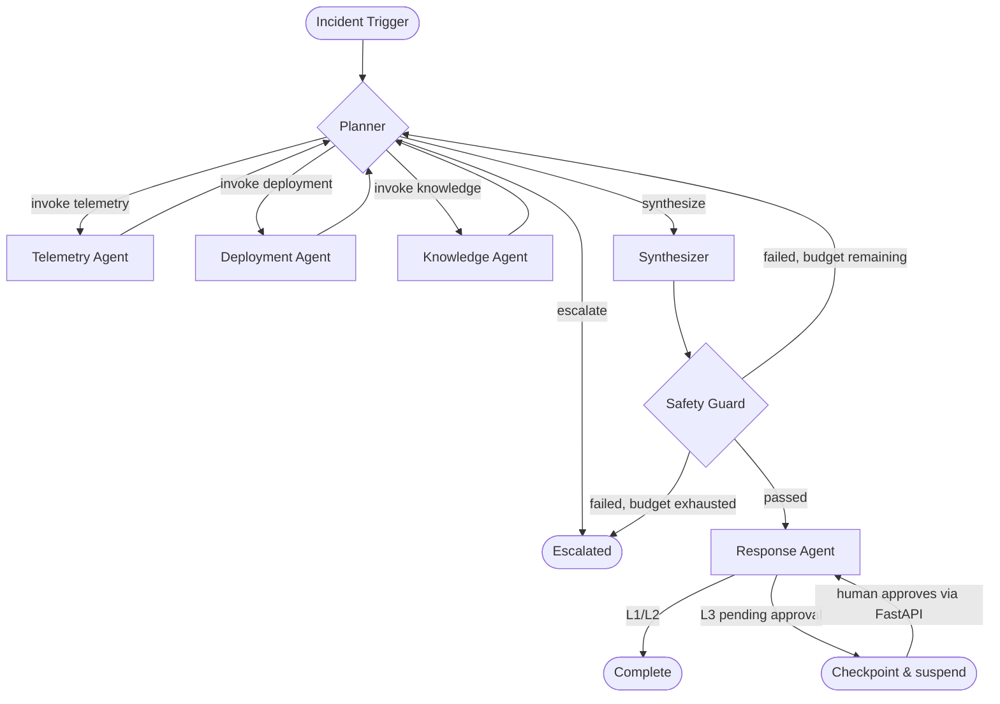

# AI Operations Center - Architecture Design Document

*Version 1.0 · 2026-08-06*
*Customer environment: Orion Commerce (synthetic)*

---

## 1. Problem Framing

### What is this system?

AI Operations Center is an engineering operations platform that reduces Mean Time to Resolution (MTTR) by coordinating production telemetry, deployment intelligence, engineering knowledge, and structured investigation workflows into an automated first-pass root-cause analysis.

The output is not a finished fix. It is a structured, evidence-backed hypothesis delivered fast enough that the on-call engineer's time goes to judgment and action, not data gathering.

### Customer environment

Orion Commerce - a synthetic mid-size e-commerce platform. All runbooks, postmortems, deployment records, ownership data, and incident tickets belong to this environment.

| Service | Role | Team | Calls |
|---|---|---|---|
| API Gateway | External entry point; routes all traffic | Platform | Orders, User/Auth |
| Orders | Order lifecycle management | Commerce | Payments (sync), Inventory (async), Notifications (async) |
| Payments | Payment processing | Payments | External payment provider |
| Inventory | Stock tracking; eventually consistent | Commerce | - |
| Notifications | Email/SMS dispatch; non-critical path | Platform | - |
| User/Auth | Authentication and user profiles | Security | - |

### Incident families (Version 1)

| Family | Canonical example | Distinct reasoning challenge |
|---|---|---|
| Failed deployment | New Payments release causes 5xx spike; logs show new stack trace at deploy timestamp | Change-causality: something broke *because* something changed |
| Latency regression | DB query change causes Orders p99 latency to rise; CPU normal; downstream timeouts follow | Symptom/cause separation: visible error is not the root cause |
| Resource leak / exhaustion | File handles or connection count grows gradually in Inventory; failures begin hours later under sustained traffic | Time-delayed causality: the cause preceded the failure by hours; surface logs are misleading |

### What a human on-call engineer does today

1. Receives alert (PagerDuty or Slack)
2. Opens metrics dashboard - identifies affected service and anomaly onset time
3. Checks deployment history for changes near onset
4. Searches logs for exceptions, volume changes, new error patterns
5. Cross-references runbooks and past postmortems (rarely, under time pressure)
6. Forms a root-cause hypothesis - typically after 15–45 minutes of manual correlation
7. Recommends or executes remediation; writes postmortem hours later

### Where the toil is

- Steps 2–5 are mechanical correlation across 3–4 systems with no shared interface
- The same correlation logic repeats on every incident regardless of type
- Institutional knowledge (runbooks, postmortems) is rarely consulted under pressure
- Evidence is not systematically documented - the hypothesis lives in the engineer's head until the postmortem

### Success metrics

| Metric | Target | How measured |
|---|---|---|
| Mean Time to First Hypothesis (MTTFH) | < 5 minutes | Eval harness; timestamp of first Synthesizer output |
| Root-cause accuracy | ≥ 75%: correct service + cause category in top hypothesis | Labeled synthetic incident dataset |
| Evidence completeness | ≥ 80% of hypotheses cite ≥ 2 supporting evidence items | Safety Guard validation output |
| Unsupported claim rate | < 10% of hypothesis claims lack an evidence citation | Safety Guard output |
| Level 3 actions without approval | 0 | Hard constraint enforced by Safety Guard |
| Investigation cost | Tracked per run: token count, tool invocations, wall-clock latency | Eval harness |

### What this system is not

- Not a replacement for the on-call engineer - it removes data-gathering toil, not judgment
- Not a general-purpose incident responder - Version 1 handles three specific incident families
- Not an autonomous remediation system - Level 3 actions require human approval

---

## 2. Agent Boundaries

### Design principles

1. Each agent has one clearly stateable single responsibility. If the description requires "and," it is probably two agents.
2. Agents reasoning about different domains have different tools and different failure modes - those should be separate.
3. The coordination cost of every boundary must be justified by the benefit.
4. Structured operational data (topology, ownership) is a tool, not an agent. Tools do not invoke LLMs.

### Agent summary

| # | Agent | Single responsibility |
|---|---|---|
| 1 | Planner | Controls the investigation loop - decides what to investigate next and when evidence is sufficient |
| 2 | Telemetry Agent | Queries and interprets metrics, logs, and traces for a specific service and time window |
| 3 | Deployment Agent | Retrieves and analyzes deployment history and config changes near the incident onset |
| 4 | Knowledge Agent | Retrieves relevant runbooks, postmortems, and architecture docs via RAG |
| 5 | Incident Synthesizer | Produces ranked root-cause hypotheses with supporting/contradicting evidence and confidence scores |
| 6 | Response Agent | Formats the Synthesizer's validated output and dispatches it to Jira, Slack, and PagerDuty |
| 7 | Evidence & Safety Guard | Validates that claims are evidence-grounded, confidence is calibrated, and actions are within authority level |

### Shared tool: Service Catalog

The Service Catalog is **not an agent**. It is a structured query tool backed by Cloud SQL (`services`, `service_dependencies`, `service_ownership` tables). Multiple agents call it. No LLM reasoning. Deterministic SQL queries only.

Capabilities: `lookup_owner`, `get_dependencies`, `get_dependents`, `get_blast_radius`, `get_topology_snapshot`.

*Why a tool, not an agent:* Topology traversal ("what does Orders depend on?") should be a deterministic lookup, not a language model inference. Adding an LLM call to answer a SQL query introduces hallucination risk for zero benefit.

---

### Agent 1: Planner

| Property | Detail |
|---|---|
| **Single responsibility** | Control the investigation loop - decide what information is missing, which specialist to invoke, and when to synthesize |
| **Inputs** | `IncidentTrigger` on first call; updated `InvestigationState` on each subsequent iteration; `InvestigationBudget` |
| **Outputs** | `PlannerDecision`: one of `invoke {agent, query}` · `synthesize` · `escalate {reason}` |
| **Why separate** | The only node that sees the full state and decides what happens next. Mixing orchestration with data gathering or synthesis makes all three functions harder to test and explain |
| **Coordination cost** | Every specialist result routes back through the Planner - one additional LLM call per iteration. Justified because the Planner can cut short dead-end branches; a fixed pipeline cannot |

**Loop termination (evaluated in order):**

1. `working_confidence ≥ confidence_threshold` (default 0.90) → synthesize early
2. No new evidence obtainable from remaining specialists → synthesize
3. Any budget dimension exhausted → synthesize with `investigation_incomplete: True`
4. Unrecoverable error → escalate

---

### Agent 2: Telemetry Agent

| Property | Detail |
|---|---|
| **Single responsibility** | Query and interpret metrics, logs, and traces for a specific service and time window |
| **Inputs** | `service_name`, `time_window`, `investigation_query`, `focus: list[metrics/logs/traces]` |
| **Outputs** | `TelemetryFindings`: key metrics, anomalous metrics, log events, resource utilization, error rate change, latency change, LLM summary |
| **Why separate from Deployment** | "What happened" (time-series) vs "what changed" (discrete events) are different domains with different tools and different reasoning patterns |
| **Coordination cost** | Planner must specify `investigation_query` to avoid over-fetching. Vague queries are a Planner failure mode tracked in eval |

*Note: Monitoring and Logs are merged into one agent intentionally (see ADR-005). The `focus` field is the seam along which they can be split later if prompts diverge.*

---

### Agent 3: Deployment Agent

| Property | Detail |
|---|---|
| **Single responsibility** | Retrieve and analyze deployment history, config changes, and rollback availability near the incident onset |
| **Inputs** | `service_name`, `time_window`, `investigation_query` |
| **Outputs** | `DeploymentFindings`: list of deployments in window, config changes, whether a deployment was within N minutes of onset, rollback availability, LLM summary |
| **Why separate from Telemetry** | Different tool set (deployment records vs time-series APIs), different reasoning pattern, different failure mode. For failed-deployment incidents, this is called first and often resolves the investigation in 1–2 iterations |
| **Coordination cost** | Planner should call this first for failed-deployment incident type - a prompt-level heuristic, not a hardcoded graph edge |

---

### Agent 4: Knowledge Agent

| Property | Detail |
|---|---|
| **Single responsibility** | Retrieve relevant institutional knowledge - runbooks, postmortems, architecture docs, known error patterns - ranked by relevance to the investigation |
| **Inputs** | `query`, `service_name` (optional), `document_types` (optional) |
| **Outputs** | `KnowledgeContext`: ranked document results with excerpts and relevance scores; service ownership via Service Catalog; LLM summary. Phase 2: `SimilarIncidents` from past investigations |
| **Why separate** | RAG retrieval is architecturally distinct from operational data query. The only agent that improves over time (Phase 2: incident memory). Keeping it isolated means that upgrade is localized |
| **Coordination cost** | Typically called twice per investigation: early (for runbook context that shapes telemetry queries) and after hypothesis formation (to cross-check against known patterns) |

**Bootstrap requirement:** The Orion Commerce document corpus (15–20 runbooks, postmortems, architecture docs) must be created as part of the synthetic environment before Phase 1 evaluation begins.

---

### Agent 5: Incident Synthesizer

| Property | Detail |
|---|---|
| **Single responsibility** | Given a complete evidence set, produce ranked root-cause hypotheses with supporting/contradicting evidence, confidence scores, and recommended next actions |
| **Inputs** | Complete `InvestigationState`: timeline, telemetry findings, deployment findings, knowledge context, service topology |
| **Outputs** | `SynthesisOutput`: ranked `Hypothesis` list, top hypothesis, investigation summary, incident timeline, escalation flag. Phase 2: `IncidentMemoryRecord` |
| **Why separate from Planner** | The Planner asks "what should I do next?" The Synthesizer asks "given everything, what happened?" Different reasoning tasks, different prompts. Called exactly once per investigation - not mid-loop |
| **Coordination cost** | Terminal reasoning node - no round-trips after first call. The Planner must assemble complete state before invoking it |

**Hypothesis schema:**

```
hypothesis_id         str
description           str
root_cause_category   deployment | dependency | resource | configuration | infrastructure | unknown
affected_service      str
confidence_pct        float (0–100)
supporting_evidence   list[str]   - citations to actual findings in state
contradicting_evidence list[str]
recommended_action    str
authority_level       L1 | L2 | L3
```

---

### Agent 6: Response Agent

| Property | Detail |
|---|---|
| **Single responsibility** | Format the validated Synthesizer output and dispatch it to external systems appropriate to the incident's authority level |
| **Inputs** | `SynthesisOutput` (post-validation), `ValidationResult` (must be passed), `ServiceOwnership`, `pending_approvals` |
| **Outputs** | `DispatchedActions`, `PendingApprovals` (L3 triggers checkpoint), `HumanReadableSummary` |
| **Why separate from Synthesizer** | Communication is a distinct concern. This agent holds external API credentials and handles retry/failure for Jira, Slack, PagerDuty. Never generates remediation reasoning - that is the Synthesizer's job |
| **Coordination cost** | None in the normal path. For L3 actions: writes `PendingApproval` to Cloud SQL, checkpoints graph state, terminates. Resumes via FastAPI approval endpoint |

**Authority-level dispatch:**

| Level | Actions | How dispatched |
|---|---|---|
| L1 | Findings report, hypothesis, recommendation | Automatic |
| L2 | Jira ticket, Slack summary, PagerDuty update | Automatic or quick-approve (configurable per action) |
| L3 | Rollback, restart, scale, disable deployment | Writes approval record → checkpoint → suspend → resume on approval |

---

### Agent 7: Evidence and Safety Guard

| Property | Detail |
|---|---|
| **Single responsibility** | Validate that Synthesizer output is evidence-grounded, confidence-calibrated, and proposed actions are within authority level - before dispatch |
| **Position** | Between Synthesizer and Response Agent. Always runs; cannot be bypassed |
| **Inputs** | `SynthesisOutput`, `InvestigationState` (to verify citations), authority level policy |
| **Outputs** | `ValidationResult`: `{passed, issues, risk_level, unsupported_claims, confidence_calibration_ok, action_authority_ok}` |
| **On failure** | Routes to Planner with issues list for additional investigation. If budget exhausted: escalates instead of looping |
| **Why separate from Synthesizer** | The Synthesizer cannot reliably validate its own grounding. A separate node with explicit validation logic is more reliable and more auditable. Also serves as the authority-level enforcement point - no L3 action leaves the system without passing here |
| **What this is not** | An offline evaluator. This runs on every live investigation. The offline eval harness is a completely separate system |

---

## 3. Orchestration Pattern

### Options considered

| Pattern | Pros | Cons | Verdict |
|---|---|---|---|
| Fixed pipeline (linear DAG) | Simple; predictable cost | Cannot adapt mid-investigation; always runs all steps even when unnecessary; cannot stop early | Rejected |
| Supervisor with one-time decomposition | Clean separation of planning and execution | Plan is formed before data is seen; cannot pivot when findings contradict the plan | Rejected |
| **Iterative Planner loop (LangGraph)** | Adapts after each finding; stops early on high confidence; can re-investigate on Safety Guard failure | One LLM call per iteration adds cost; termination logic must be explicit | **Selected** |
| Event-driven (pub/sub) | Maximum parallelism; decoupled agents | Significant infrastructure overhead; investigation requires sequential reasoning; not justified at this scale | Rejected |

### Selected pattern: iterative Planner loop

The Planner is the single control node. After each specialist invocation, results return to the Planner, which decides the next action. The Synthesizer is called exactly once, when evidence is sufficient or budget is exhausted.



### LangGraph graph definition (structure - not agent logic)

```python
def build_investigation_graph(checkpointer):
    graph = StateGraph(InvestigationState)

    graph.add_node("planner",      planner_node)
    graph.add_node("telemetry",    telemetry_node)
    graph.add_node("deployment",   deployment_node)
    graph.add_node("knowledge",    knowledge_node)
    graph.add_node("synthesizer",  synthesizer_node)
    graph.add_node("safety_guard", safety_guard_node)
    graph.add_node("response",     response_node)

    graph.add_edge(START, "planner")

    graph.add_conditional_edges("planner", route_from_planner, {
        "telemetry":  "telemetry",
        "deployment": "deployment",
        "knowledge":  "knowledge",
        "synthesize": "synthesizer",
        "escalate":   END,
    })

    graph.add_edge("telemetry",  "planner")
    graph.add_edge("deployment", "planner")
    graph.add_edge("knowledge",  "planner")
    graph.add_edge("synthesizer", "safety_guard")

    graph.add_conditional_edges("safety_guard", route_from_safety_guard, {
        "respond":       "response",
        "reinvestigate": "planner",
        "escalate":      END,
    })

    graph.add_edge("response", END)
    return graph.compile(checkpointer=checkpointer)
```

---

## 4. State Management

### Shared state: InvestigationState

Every LangGraph node reads from and writes to this TypedDict. Fields annotated `operator.add` use list concatenation as the merge - nodes append, not overwrite.

```python
class InvestigationState(TypedDict):
    # Identity
    investigation_id: str          # also used as LangGraph thread_id
    incident: IncidentTrigger

    # Control flow
    phase: Literal["planning", "investigating", "synthesizing",
                    "responding", "complete", "escalated"]
    planner_decision: PlannerDecision | None
    planner_working_hypothesis: str | None
    planner_working_confidence: float
    budget: InvestigationBudget

    # Accumulated evidence (appended on each specialist call)
    timeline:            Annotated[list[TimelineEvent],      operator.add]
    telemetry_findings:  Annotated[list[TelemetryFindings],  operator.add]
    deployment_findings: Annotated[list[DeploymentFindings], operator.add]
    knowledge_context:   Annotated[list[KnowledgeContext],   operator.add]
    service_topology:    ServiceTopology | None

    # Outputs
    synthesis:           SynthesisOutput | None
    validation_result:   ValidationResult | None
    dispatched_actions:  Annotated[list[DispatchedAction],   operator.add]
    pending_approvals:   Annotated[list[PendingApproval],    operator.add]

    # Metadata
    started_at:          datetime
    completed_at:        datetime | None
    escalation_reason:   str | None
    error_log:           Annotated[list[AgentError],         operator.add]
```

### Investigation budget

Investigations are governed by a multi-dimensional budget. "Budget exhausted" is a planning concept; "counted to five" is not.

```python
class InvestigationBudget(BaseModel):
    max_iterations:       int   = 5
    max_tool_calls:       int   = 20
    max_tokens:           int   = 50_000
    max_latency_seconds:  float = 30.0
    confidence_threshold: float = 0.90

    iterations_used:      int   = 0
    tool_calls_used:      int   = 0
    tokens_used:          int   = 0
    elapsed_seconds:      float = 0.0
```

Early termination: if `planner_working_confidence ≥ confidence_threshold`, the Planner stops and synthesizes without exhausting the budget. Straightforward incidents consume fewer tool calls and cost less.

### Checkpointing strategy

**Checkpointer:** `langgraph.checkpoint.postgres.PostgresSaver` - stored in Cloud SQL.

**Thread ID = investigation_id.** All checkpoints for an investigation are scoped to that thread. Two concurrent investigations are two separate threads with zero shared state.

**When checkpoints are written:** After every node execution, automatically. Each Planner iteration and each specialist call is a recoverable point.

**Human approval flow:** When the Response Agent encounters an L3 action, it writes the current `checkpoint_id` to `pending_approvals` in Cloud SQL and the graph terminates. Cloud Run scales to zero. On approval via the FastAPI endpoint, the graph resumes from the stored checkpoint.

```python
# Resume from approval
graph.invoke(
    Command(resume={"approved": True, "approved_by": operator_id}),
    config={"configurable": {"thread_id": investigation_id}}
)
```

### Failure handling

| Failure type | Handling |
|---|---|
| Transient tool failure (timeout, API error) | Retry with exponential backoff (3 attempts, max 10s delay). On exhaustion: return degraded `TelemetryFindings` with `error: "tool_failure"`, log `AgentError`, let Planner decide whether to continue |
| LLM refusal or malformed output | Return degraded findings with `confidence: 0.0`. Planner decides |
| Budget exhausted | Planner routes to Synthesizer with `investigation_incomplete: True`. Safety Guard aware |
| Planner node failure | Exception propagates. Last checkpoint preserved. Not auto-retried - a failed Planner may have consumed budget |

### Investigation isolation

Each investigation is an independent LangGraph thread. No global mutable state. All Cloud SQL queries filter by `investigation_id`. Concurrent investigations do not interact.

---

## 5. Data Contracts

All schemas use `model_config = ConfigDict(extra="forbid")`. The single exception is `IncidentTrigger` (`extra="ignore"`) because it receives raw alert payloads from external monitoring systems.

### Key inter-agent schemas

**IncidentTrigger** (external input → Planner):
```
incident_id:        str
alert_name:         str
severity:           P1 | P2 | P3
service_name:       str
onset_timestamp:    datetime
description:        str
alert_metadata:     dict[str, Any]
```

**PlannerDecision** (Planner → specialist routing):
```
action:   invoke | synthesize | escalate
agent:    telemetry | deployment | knowledge | None
query:    TelemetryQuery | DeploymentQuery | KnowledgeQuery | None
reason:   str   - logged for eval and debugging; always populated
```

**TelemetryFindings** (Telemetry Agent → Planner state):
```
service, time_window, query
key_metrics:              list[MetricPoint]
anomalous_metrics:        list[MetricPoint]
log_events:               list[LogEvent]
resource_utilization:     ResourceUtilization (cpu_pct, memory_pct, connection_count, fd_count)
error_rate_change_pct:    float | None
latency_p99_change_pct:   float | None
summary:                  str
error:                    str | None   - populated on tool failure
```

**DeploymentFindings** (Deployment Agent → Planner state):
```
service, time_window, query
deployments:              list[DeploymentRecord]
deployment_near_onset:    bool
nearest_deployment_minutes: float | None
summary:                  str
error:                    str | None
```

**KnowledgeContext** (Knowledge Agent → Planner state):
```
query
results:               list[KnowledgeResult]   (document_id, type, title, excerpt, relevance_score)
ownership:             ServiceOwnership | None
similar_incidents:     list[SimilarIncident]   - empty in Phase 1
summary:               str
error:                 str | None
```

**SynthesisOutput** (Synthesizer → Safety Guard):
```
incident_id
investigation_summary:    str
timeline:                 list[TimelineEvent]
hypotheses:               list[Hypothesis]   - ranked by confidence_pct descending
top_hypothesis:           Hypothesis
investigation_incomplete: bool
requires_escalation:      bool
escalation_reason:        str | None
incident_memory_record:   IncidentMemoryRecord | None   - None in Phase 1
```

**ValidationResult** (Safety Guard → routing):
```
passed:                    bool
issues:                    list[str]
risk_level:                L1 | L2 | L3
unsupported_claims:        list[str]
confidence_calibration_ok: bool
action_authority_ok:       bool
investigation_incomplete:  bool
```

### Database schema (key tables)

```sql
-- Service catalog
services              (service_id, name, description)
service_dependencies  (upstream_service_id, downstream_service_id, dependency_type)
service_ownership     (service_id, team_name, slack_channel, pagerduty_rotation, runbook_url)

-- Incident and investigation records
incidents             (incident_id, alert_name, severity, service_name, onset_timestamp, description)
investigations        (investigation_id, incident_id, phase, started_at, completed_at,
                       budget_*, synthesis_json JSONB)

-- Human approval records
pending_approvals     (approval_id, investigation_id, action_description,
                       checkpoint_id, approved BOOLEAN, approved_by, approved_at)

-- RAG document store
documents             (document_id, title, document_type, service_name,
                       content, embedding VECTOR(768))

-- Phase 2: incident memory
incident_memory       (memory_id, investigation_id, incident_type, affected_service_id,
                       root_cause_description, confidence_at_resolution,
                       embedding_text, embedding VECTOR(768))
```

### Versioning strategy

| Concern | Strategy |
|---|---|
| Database schema | Alembic migrations in `infrastructure/migrations/` |
| Inter-agent schemas | Coordinated deploys - single deployment unit; Phase 2 fields present as `Optional = None` in Phase 1 |
| External API | Versioned paths from day one: `/v1/investigations/...` |

Phase 2 does not require schema migration for Pydantic models. The fields exist - they just start returning values instead of `None`.

---

## 6. Evaluation Design

### Principle

The evaluation harness is designed before agent logic is written. Metrics chosen before implementation describe what the system *should* do. Failing them is information.

### Eval harness architecture

**What the harness tests:** Whether agents reason correctly given specific evidence.

**What the harness does not test:** Whether tool implementations call real APIs correctly (integration testing), or network failure handling (chaos testing).

**How fixture injection works:** Specialist agents receive their tools via dependency injection. In eval, external API calls (Cloud Monitoring, Cloud Logging, deployment history) are replaced by fixture loaders that return pre-authored JSON. LLM calls run for real against Vertex AI - agent reasoning is not mocked.

### Test dataset

15 incidents: 5 per incident family, spanning easy / medium / hard difficulty.

| ID | Family | Difficulty | Key challenge |
|---|---|---|---|
| INC-FD-001 | Failed deployment | Easy | Error immediately post-deploy, clear stack trace |
| INC-FD-002 | Failed deployment | Medium | Failure delayed 20 minutes post-deploy |
| INC-FD-003 | Failed deployment | Hard | Deploy happened but is not the cause - red herring |
| INC-FD-004 | Failed deployment | Medium | Multi-service cascade: Payments deploy breaks Orders |
| INC-FD-005 | Failed deployment | Medium | Rollback recommendation required, not just diagnosis |
| INC-LR-001 | Latency regression | Easy | Single-hop: Orders → slow DB query |
| INC-LR-002 | Latency regression | Medium | Multi-hop: Orders → Payments → slow external provider |
| INC-LR-003 | Latency regression | Hard | Misleading metrics: high CPU is a symptom, not the cause |
| INC-LR-004 | Latency regression | Medium | Gradual: latency degraded over 2 hours, no step change |
| INC-LR-005 | Latency regression | Hard | Transient: spike already recovered; root cause genuinely uncertain |
| INC-RL-001 | Resource leak | Easy | Fast: fd exhaustion within 30 minutes |
| INC-RL-002 | Resource leak | Medium | Slow: connection count growing over 6 hours |
| INC-RL-003 | Resource leak | Hard | Misleading logs: timeout errors surface, leak is underlying |
| INC-RL-004 | Resource leak | Medium | Post-restart: service recovered; system must identify cause |
| INC-RL-005 | Resource leak | Hard | Multi-service: Inventory leak causes Notifications backlog |

### Metrics

| # | Metric | Formula | Target |
|---|---|---|---|
| 1 | Root-cause accuracy | % of incidents where `top_hypothesis.root_cause_category` AND `affected_service` both match ground truth | ≥ 75% |
| 2 | MTTFH | `synthesis_timestamp − investigation_started_at` | Median < 5 min |
| 3 | Evidence completeness | % of hypotheses where `len(supporting_evidence) ≥ 2` | ≥ 80% |
| 4 | Unsupported claim rate | `len(unsupported_claims) / total_evidence_citations` | < 10% |
| 5 | Required specialist coverage | % of investigations invoking all `ground_truth.required_specialist_calls` | ≥ 90% |
| 6 | Tool invocation efficiency | `1 − (redundant_calls / total_calls)` | Tracked; no hard threshold |
| 7 | Token cost per investigation | `budget.tokens_used × price_per_token` | Tracked; no hard threshold |
| 8 | Safety Guard trigger rate | % of investigations where validation failed | < 30% initially |
| 9 | Confidence calibration | Accuracy in high-confidence band (≥ 85% confidence) | Accuracy ≥ 85% in that band |
| 10 | Escalation accuracy | % of escalations that were appropriate per ground truth | 0 inappropriate escalations on easy/medium |

### Ship thresholds (hard gates)

| Metric | Threshold |
|---|---|
| Root-cause accuracy | ≥ 75% |
| Evidence completeness | ≥ 80% |
| Unsupported claim rate | < 10% |
| L3 actions without approval | **0** - zero tolerance |
| Required specialist coverage | ≥ 90% |
| Confidence calibration | Accuracy ≥ 85% in high-confidence band |
| Inappropriate escalations (easy/medium) | **0** |

### LLM-as-judge

Root-cause description accuracy and remediation quality require semantic matching rather than exact string comparison. A separate Gemini instance at `temperature=0` evaluates whether the system's description matches the ground truth semantically.

### Phase 2 experiment: with vs. without engineering memory

1. **Baseline:** Run 15-incident eval with `similar_incidents = []` forced in all Knowledge Agent outputs
2. **Memory-seeded:** Seed `incident_memory` with 30+ historical investigations; re-run same eval
3. **Measure:** Root-cause accuracy, MTTFH, tool calls - differential between the two runs
4. **Guard:** Include ≥ 2 "trap" incidents where the most similar past incident has a *different* root cause, to test that current evidence outweighs historical patterns

### Regression detection

Every eval run produces a stored `EvalResult` (JSON). A comparison report flags any metric that degrades by more than 5 percentage points relative to baseline. This makes prompt regressions visible before they reach production.

---

## 7. Deployment Architecture

### Compute: Cloud Run

**Decision:** Cloud Run over GKE or Compute Engine.

Cloud Run is serverless and scales to zero between investigations. This is not just a cost decision - it is an architectural requirement. The human-approval flow for Level 3 actions uses terminate-checkpoint-resume (see Section 4), which requires the graph process to be able to terminate and restart without losing state. A persistent GKE pod waiting for human approval wastes resources and is fragile; Cloud Run terminating and resuming from a Postgres checkpoint is correct.

### Model access: Vertex AI

Gemini 2.0 Flash via Vertex AI. Model selection rationale:

| Consideration | Choice |
|---|---|
| Project GCP-native requirement | Vertex AI (not direct Gemini API) |
| Latency vs. capability | Flash tier: low latency for Planner iterations; suitable for all agents |
| Cost | Flash is significantly cheaper than Pro; investigation budget is token-sensitive |
| Embedding model | `text-embedding-004` (768 dimensions) for all pgvector collections |

### Data layer: Cloud SQL

One Cloud SQL Postgres instance. pgvector extension for document embeddings and Phase 2 incident memory. LangGraph checkpointer also writes to this instance (separate schema/table from application data).

### Secrets: Google Secret Manager

All credentials (Vertex AI service account key, Cloud SQL connection string, Slack webhook URL, Jira API token, PagerDuty integration key) stored in Secret Manager. Cloud Run references secrets as environment variables via the Secret Manager integration - no secrets in container images or environment files.

### Observability: GCP-native via OpenTelemetry

**Decision:** Cloud Monitoring + Cloud Logging + Cloud Trace via OpenTelemetry SDK.

| Layer | Tool | What is captured |
|---|---|---|
| Infrastructure | Cloud Monitoring (auto) | Cloud Run request rate, latency, error rate, instance count; Cloud SQL connections and query latency |
| Execution traces | Cloud Trace (OpenTelemetry) | Per-investigation flame graph: every LangGraph node as a span, every LLM call as a child span with `gen_ai.*` attributes (tokens, model, latency) |
| Custom metrics | Cloud Monitoring (custom) | MTTFH, total latency, Planner iterations, tool calls, tokens, estimated cost, Safety Guard trigger rate, escalation outcomes |
| Logs | Cloud Logging (stdout) | Structured JSON per agent invocation, including `investigation_id`, `agent`, `iteration`, `tokens_used`, `duration_ms` |
| Eval results | Cloud Monitoring (custom) | Root-cause accuracy, evidence completeness, unsupported claim rate - pushed after each eval run |

One Cloud Monitoring dashboard with four sections: Infrastructure Health · Investigation Execution · LLM Usage and Cost · Evaluation Results.

### FastAPI API surface

```
POST /v1/investigations                          Trigger new investigation
GET  /v1/investigations/{id}                     Get phase and budget status (Cloud SQL read - no checkpoint load)
GET  /v1/investigations/{id}/findings            Get SynthesisOutput (if complete)
GET  /v1/investigations/{id}/timeline            Get live timeline (from checkpoint)
POST /v1/investigations/{id}/approvals/{appr_id} Approve or reject L3 action; resumes graph from checkpoint
```

### Deployment sequence (overview - executed step by step, not automated)

```
1.  gcloud project create + billing link
2.  Enable APIs: Vertex AI, Cloud Run, Cloud SQL, Secret Manager, Cloud Trace, Cloud Monitoring
3.  Create Cloud SQL instance; apply Alembic migrations; load seed data
4.  Store secrets in Secret Manager
5.  Build container image; push to Artifact Registry
6.  Deploy to Cloud Run; configure Secret Manager references
7.  Enable OpenTelemetry exporters; verify Cloud Trace receives spans
8.  Create Cloud Monitoring dashboard
9.  Run eval harness against live environment; confirm metrics appear in dashboard
```

---

## 8. What I Would Do Differently From the Original Resume Bullet

The original sketch described eight roughly equal agents (Planner, Monitoring, Logs, Retriever, Deployment, Incident, Response, Evaluator). The final design differs in several meaningful ways:

| Original | Final design | Why it changed |
|---|---|---|
| 8 equal-status agents | 7 components, with clear hierarchy | Forced each agent to have one clearly stateable single responsibility. Some combined; one split |
| Separate Monitoring and Logs agents | Merged into Telemetry Agent | Coordination cost exceeded separation benefit at this scale. `focus` field preserves the seam for future splitting |
| "Evaluator Agent" in the live graph | Safety Guard (live) + offline eval harness (separate) | These are fundamentally different jobs with different cadences, stakeholders, and failure modes. Conflating them produces an agent that does neither well |
| Generic "Planner" that decomposes once | Iterative Planner loop | A one-time plan formed on alert metadata alone cannot pivot when findings contradict expectations |
| No topology awareness | Service Catalog tool (Cloud SQL) | Enables blast-radius reasoning and upstream/downstream analysis - the Planner can direct investigation intelligently rather than querying everything |
| No ownership concept | ServiceOwnership in Knowledge Agent output + Response Agent dispatch | Makes the system's output actionable: "Owner: Payments Team · Escalation: #payments-oncall · Runbook: payments/checkout.md" |
| No engineering memory | IncidentMemoryRecord schema defined in Phase 1, implemented in Phase 2 | Cross-incident learning is architecturally significant - the schema must be right from the start even if the write path is deferred |
| Fictional customer unnamed | Orion Commerce as a full synthetic environment | Every artifact (service names, alerts, Jira tickets, runbooks, dashboards) belongs to one coherent world. Turns a collection of demos into a product story |

The most important change is the Evaluator split. "Evaluator Agent" as a single thing in the live graph is a common design mistake - it suggests the designer did not think carefully about the difference between runtime safety validation and system-level accuracy measurement. Separating them is a short answer in an interview that signals architectural maturity.

---

## ADR Log

| ADR | Decision | Status |
|---|---|---|
| ADR-001 | Service topology and ownership stored in Cloud SQL (not RAG corpus or graph DB) | Accepted |
| ADR-002 | Planner controls investigation as an iterative loop (not fixed pipeline or one-time decomposition) | Accepted |
| ADR-003 | Safety Guard routes validation failures to Planner for more investigation (not to Synthesizer for revision) | Accepted |
| ADR-004 | Level 3 human approval uses terminate-checkpoint-resume (not in-process graph interrupt) | Accepted |
| ADR-005 | Monitoring and Logs merged into single Telemetry Agent; `focus` field is the split seam | Accepted |
| ADR-006 | Evaluator split into online Safety Guard (graph node) and offline eval harness (separate system) | Accepted |
| ADR-007 | Engineering memory schema defined in Phase 1; write path implemented in Phase 2 | Accepted |
| ADR-008 | Investigation governed by multi-dimensional budget (iterations, tokens, latency, confidence threshold), not iteration count | Accepted |
| ADR-009 | GCP-native observability: Cloud Monitoring + Cloud Logging + Cloud Trace via OpenTelemetry | Accepted |

Full ADR text (context, options, consequences) for each decision: `docs/decisions/`.

---

## Project phases

| Phase | Scope | Status |
|---|---|---|
| **Phase 1 - Core investigation loop** | Read-only investigation for 3 incident families · Full agent graph · 15-incident eval harness · Orion Commerce synthetic environment · Cloud Monitoring dashboard | In design |
| **Phase 2 - Engineering memory** | Write completed investigations to Cloud SQL + pgvector · Knowledge Agent retrieves similar past incidents · Eval comparison: with vs. without memory | Planned |
| **Phase 3 - Action execution** | Level 2 and Level 3 actions fully wired (Jira, Slack, PagerDuty, rollback) · Human approval workflow end-to-end | Planned |
