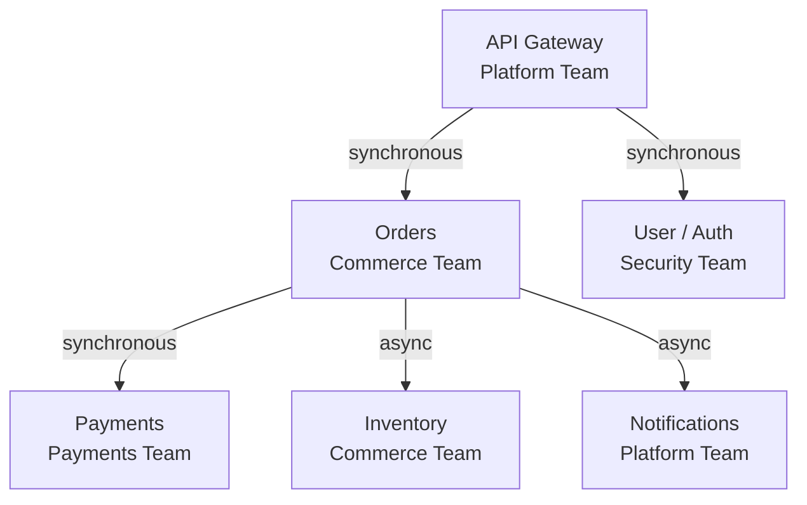
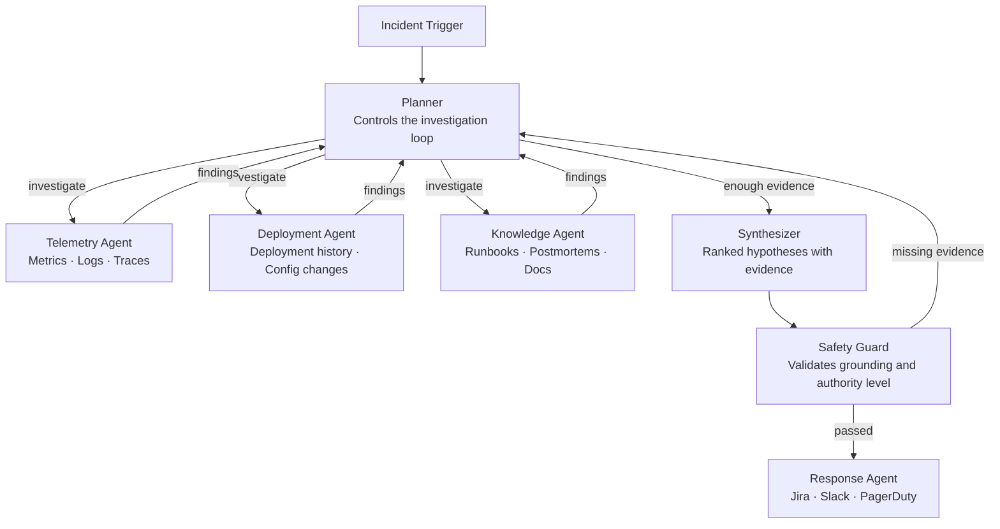
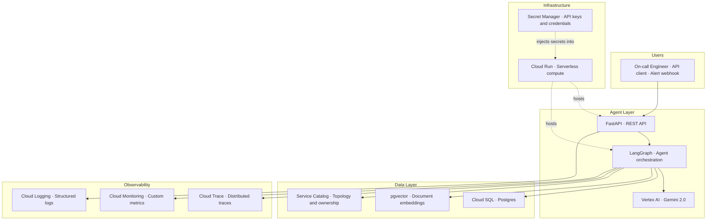

# AI Operations Center — Project Brief

*A multi-agent system that automates production incident investigation on Google Cloud Platform.*

---

## The problem

When something breaks in production — a service throwing errors, response times spiking, a server running out of memory — an on-call engineer has to manually piece together what happened. They open four or five different tools: a metrics dashboard, a log search interface, a deployment history page, a runbook wiki. They correlate timestamps by hand. They form a hypothesis from memory and experience. The whole process takes 15 to 45 minutes, every time, for every incident.

This is not a judgment problem. It is a data-gathering problem. The engineer already knows how to diagnose most incidents once they have the data in front of them. The system automates the data-gathering so the engineer can focus on the part that actually requires human judgment: deciding what to do.

---

## What the system does

AI Operations Center receives an alert, launches an automated investigation, and returns a structured diagnosis within minutes:

- Which service is the root cause
- What category of failure it is (bad deployment, slow database query, resource leak, etc.)
- Supporting and contradicting evidence
- A confidence score
- A recommended next action

The on-call engineer reads the report, confirms or overrides the hypothesis, and acts. The toil is eliminated. The judgment remains human.

---

## The fictional customer: Orion Commerce

All incidents, runbooks, deployment history, and ownership records in this system belong to a synthetic mid-size e-commerce company called **Orion Commerce**. Using a consistent fictional customer means every artifact in the project — service names, alert descriptions, postmortems, Jira tickets — belongs to one coherent world rather than a collection of disconnected demos.

### Orion Commerce services



The topology matters because it lets the system reason about causality. If Orders latency increases, the system checks whether Payments (which Orders calls synchronously) is the source rather than assuming Orders is the culprit.

---

## Three incident families the system investigates

### A — Failed deployment

A new release introduces a bug. Error rates increase immediately after deployment. Logs show a new exception. The fix is a rollback.

*What makes this hard:* downstream services (like Orders) also show elevated errors, because they call the broken service. The system must identify the root service, not just the symptom.

### B — Latency regression

A database query change causes response times to climb. CPU is normal. No exceptions in logs. Downstream services start timing out. The surface symptom (timeouts) is not the root cause (slow query).

*What makes this hard:* the system must distinguish a symptom from its cause — downstream timeouts are real, but blaming the downstream service would be wrong.

### C — Resource leak / exhaustion

File handles, memory, or database connections grow gradually. The service looks healthy at first. Hours later, failures begin under sustained traffic. A restart fixes it temporarily. Logs may suggest unrelated causes (payload size, timeouts) rather than the real problem.

*What makes this hard:* the cause preceded the failure by hours, and the visible error messages are misleading.

---

## The agents

The system is built from seven specialised components that work together:



### What each agent does

| Agent | One-line role |
|---|---|
| **Planner** | Decides what to investigate next, and when enough evidence exists to stop |
| **Telemetry** | Queries metrics, logs, and traces for a specific service and time window |
| **Deployment** | Retrieves deployment history and configuration changes near the incident |
| **Knowledge** | Searches runbooks, postmortems, and architecture docs for relevant context |
| **Synthesizer** | Produces ranked root-cause hypotheses with supporting and contradicting evidence |
| **Safety Guard** | Checks that every claim is backed by evidence before anything is sent out |
| **Response** | Formats the diagnosis and dispatches it to Jira, Slack, and PagerDuty |

### Why it loops

A real engineer does not run through a fixed checklist. They check metrics, form a hypothesis, test it with logs, revise the hypothesis, and stop when confident. The Planner works the same way. It reviews findings after each step and decides what to do next — not just what step comes after in a sequence.

This means the system can stop early on a simple incident (fewer tool calls, lower cost) and dig deeper on a complex one (more iterations, more evidence).

---

## The investigation flow

### Happy path: failed deployment

```
09:00 · Alert fires on Payments — 5xx rate elevated
        ↓
09:00 · Planner fetches Orion service topology
        Payments depends on: external payment provider
        Payments is depended on by: Orders
        ↓
09:01 · Planner → Deployment Agent
        "Check Payments deployment history, 08:30–09:00"
        Deployment Agent: version 2.4.1 deployed at 08:57
        ↓
09:02 · Planner → Telemetry Agent
        "Check Payments metrics and logs, 08:55–09:05"
        Telemetry Agent: error rate +340% from 08:57, new NullPointerException in logs
        ↓
09:03 · Planner: working confidence 94% — sufficient evidence
        ↓
09:03 · Synthesizer produces hypothesis:
        Root cause: deployment (Payments v2.4.1)
        Confidence: 94%
        Supporting: deployment at 08:57 · error spike from 08:57 · new exception absent from v2.4.0
        Contradicting: none
        Recommended action: roll back to v2.4.0 [Level 2 — auto-dispatch]
        ↓
09:04 · Safety Guard: all claims grounded ✓ authority level correct ✓
        ↓
09:04 · Response Agent:
        Jira ticket created · Payments team notified on Slack · PagerDuty updated
        Investigation complete — 4 minutes elapsed
```

### Level 3 approval path

For high-risk actions (rollback, service restart, scale), the system pauses and requires human sign-off before executing:

```
System proposes: restart Payments service
        ↓
System saves its state and suspends
        ↓
On-call engineer receives Slack notification with evidence summary
        ↓
Engineer approves via link
        ↓
System resumes and executes the action
```

The system never executes high-risk actions autonomously.

---

## Authority levels

| Level | Who decides | Examples |
|---|---|---|
| L1 — Read-only | Fully automatic | Produce hypothesis, recommend action, attach evidence |
| L2 — Low-risk | Automatic (or quick-approve) | Create Jira ticket, send Slack summary, tag service owner |
| L3 — High-risk | Requires human approval | Roll back deployment, restart service, scale Cloud Run |

---

## What success looks like

| Metric | Target |
|---|---|
| Time to first hypothesis | Under 5 minutes |
| Root-cause accuracy | Correct service and cause ≥ 75% of the time |
| Evidence completeness | ≥ 80% of hypotheses cite at least 2 supporting pieces of evidence |
| Unsupported claims | < 10% of evidence citations are not traceable to actual findings |
| High-risk actions without approval | Zero — hard constraint |

---

## Tech stack



| Component | Technology | Why |
|---|---|---|
| Agent orchestration | LangGraph | Graph/state-machine pattern; built-in checkpointing; iterative loop support |
| LLM | Gemini 2.0 via Vertex AI | GCP-native; required for production GCP deployments |
| API layer | FastAPI | Consistent with existing seed projects; async-native |
| Relational data | Cloud SQL (Postgres) | Service catalog, incident records, approval state |
| Vector search | pgvector | RAG over runbooks and postmortems; Phase 2: incident memory |
| Deployment | Cloud Run | Serverless; scales to zero; works with the human-approval checkpoint pattern |
| Secrets | Google Secret Manager | GCP-native credential management |
| Observability | Cloud Monitoring + Cloud Logging + Cloud Trace | GCP-native; OpenTelemetry instrumentation; no additional managed services |

---

## Key architecture decisions

Each decision below has a full Architecture Decision Record in `docs/decisions/` explaining the alternatives considered and rejected.

| Decision | What was chosen | What was rejected and why |
|---|---|---|
| Service topology storage | Cloud SQL — deterministic queries | RAG corpus — LLM interpretation of graph traversal is non-deterministic |
| Orchestration pattern | Iterative Planner loop | Fixed pipeline — cannot adapt mid-investigation |
| Safety Guard routing on failure | Back to Planner for more evidence | Back to Synthesizer — Synthesizer cannot invent evidence it does not have |
| Level 3 approval mechanism | Terminate → checkpoint → resume on approval | In-process wait — incompatible with Cloud Run's scale-to-zero model |
| Monitoring + Logs | Merged into one Telemetry Agent | Separate agents — coordination cost exceeds benefit at this scale |
| Evaluator design | Online Safety Guard + offline eval harness | Single Evaluator agent — two different jobs with different cadences |
| Engineering memory | Schema defined in Phase 1, implemented in Phase 2 | Implement now — adds write path before core loop is validated |
| Investigation termination | Multi-dimensional budget (iterations, tokens, latency, confidence threshold) | Hard iteration count — "counted to 5" is not a planning concept |
| Observability | GCP-native stack via OpenTelemetry | Datadog — external dependency inconsistent with GCP-native architecture |

---

## Project phases

### Phase 1 — Core investigation loop (current)

Read-only investigation across three incident families. Full agent graph, evaluation harness, synthetic Orion Commerce environment with fixtures, Cloud Monitoring dashboard.

### Phase 2 — Engineering memory

Completed investigations are stored in Cloud SQL and pgvector. The Knowledge Agent retrieves similar past investigations. The evaluation harness compares accuracy with and without memory enabled.

### Phase 3 — Action execution

Level 2 and Level 3 actions with the human-approval workflow fully wired to Jira, Slack, and PagerDuty.

---

## Evaluation

The evaluation harness runs against 15 labelled synthetic incidents (5 per incident family: easy, medium, hard). It tests with real Gemini model calls but uses fixture data in place of real Cloud Monitoring and Cloud Logging responses — so results are reproducible.

Every investigation is scored on:

- **Root-cause accuracy** — did the system identify the right service and the right cause?
- **Evidence completeness** — was the hypothesis backed by at least 2 pieces of evidence?
- **Planner discipline** — did the Planner call all the specialists needed for this incident type?
- **Confidence calibration** — is the system's stated confidence correlated with its actual accuracy?
- **Cost and efficiency** — how many tool calls and tokens did it take?

Results are pushed to Cloud Monitoring so the same dashboard used for production monitoring shows evaluation quality over time. A regression in root-cause accuracy after a prompt change shows up in the same place as a Cloud Run error spike.

---

*Full technical documentation, architecture decision records, data model, and evaluation design: `docs/` in the project repository.*
